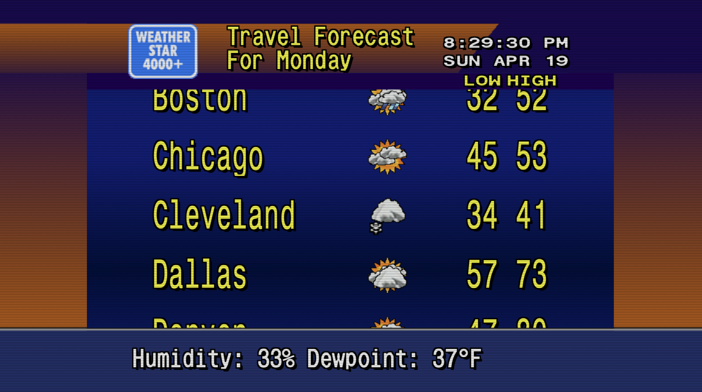

# Self-hosted Weather Channel



A self-hosted 90's-era Weather Channel, accessible via Plex. 
Contained within is the `docker-compose` necessary to run the application(s) along with any lessons learned during my setup, for posterity. 

## Project details

- [ws4kp](https://github.com/netbymatt/ws4kp)
- [ws4channels](https://github.com/rice9797/ws4channels)
- [xteve](https://hub.docker.com/r/alturismo/xteve)
- [docker](https://docs.docker.com/engine/install/ubuntu/)

**NOTE:** These instructions are incomplete, from memory, and untested

Initially, I learned of this project through an article titled [I brought back the 1980s Weather Channel by self-hosting it](https://www.howtogeek.com/i-brought-back-the-1980s-weather-channel-by-self-hosting-it/) and knew immediately I had to try. 

I used ChatGPT to help with the setup. Much of the specifics were lost to that cycle but ultimately, it requires each of these pieces of software being run (in docker) in order to function. In the shortest summary possible:

1) pull images of each utility into docker

    ```bash
    docker pull ghcr.io/netbymatt/ws4kp:latest
    docker pull ghcr.io/rice9797/ws4channels:latest
    docker pull alturismo/xteve:latest
    ```

2) start up each docker image (this file currently only handles the wk* utilities; xteve needs to be started manually)

    ```bash
    # in the same directory as docker-compose.yml
    docker compose up -d
    ```

3) `ws4kp` should be running at http://<server-ip>:8080

4) `ws4channels` should be publishing a playlist to http://<server-ip>:9798/playlist.m3u and XML Guide to http://<server-ip>:9798/guide.xml

5) `xteve` has a WebUI at http://<server-ip>:34400/web/ where a lot of the configuration will take place

6) add a Tuner/DVR in Plex; it should auto-detect but Guide XML must be provided in step 1

